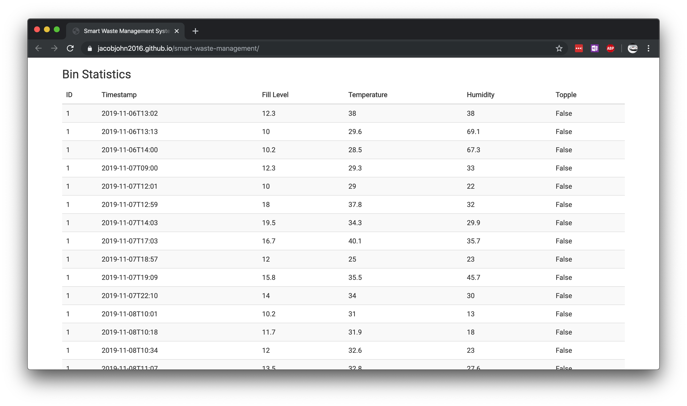

# Smart Waste Management
 
A smart waste management system that monitors and predicts waste disposal patterns of an area.

## Monitoring using the Arduino

### Components required
1. Arduino Geniuno Board
2. LED x 6 - for displaying the fill level and ON/OFF indication
3. 1K Ω Resistors x 6 - for the LEDs
4. ESP8266 - WiFI module for sending data to Firebase
5. ADXL-335 - Accelerometer for topple detection
6. Ultrasonic Sensors x 2 - one for fill level, one for opening and closing bin
7. DHT22 - Temperature and Humidity Monitoring for safety

### Codes for the Arduino
1. [Arduino Sensor Code](/arduino-codes/IoT_waste_management/IoT_waste_management.ino)
2. [Firebase Code](/arduino-codes/IoT_waste_management/IoT_waste_management.ino)


## Webpage for displaying statistics

```
.
├── docs
   ├── index.html           // main page
   ├── input.html           // page for manually inputting data (if required)
   ├── render_bar.js        // script to display bin statistics
   ├── render_charts.js     // script to display time series graphs
   └── script.js            // main script to load
```

1. Ensure that you go to console.firebase.com
2. Create an App
3. Produce your API key/secret token
4. Edit the firebaseConfig object given in `script.js`.





## Prediction model using Python

The code for the LSTM prediction model can be found in this [notebook](prediction/LSTM_fill_level.ipynb)

### Requirements
```
Python3.6+
cycler==0.10.0
h5py==2.10.0
joblib==0.14.0
Keras==2.3.1
Keras-Applications==1.0.8
Keras-Preprocessing==1.1.0
kiwisolver==1.1.0
matplotlib==3.1.1
numpy==1.17.3
pandas==0.25.3
pyparsing==2.4.4
pypi==2.1
python-dateutil==2.8.1
pytz==2019.3
PyYAML==5.1.2
scikit-learn==0.21.3
scipy==1.3.1
six==1.13.0
sklearn==0.0
```

### Dataset


### Epoch Loss for models
